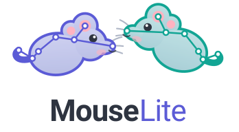

# MouseLite

<div align="center"></div>

<div align="center">

[](https://www.biorxiv.org/content/10.64898/2026.10.02.756254v1)
[](https://huggingface.co/datasets/juancobos/MultiTaskMouseBehaviour)
[](https://zenodo.org/records/23035460)

</div>

Real-time mouse detection, segmentation and pose estimation.

MouseLite finds every mouse in a video, keeps its identity from frame to frame, and
optionally places keypoints on its body. You get back an annotated video to check by
eye, a COCO export, and CSV tables of positions and per-track statistics.

## What do you want to do?

| You want to… | Use | What it takes |
| --- | --- | --- |
| Analyse videos by drag-and-drop | [the app](#the-app), in your browser | two lines in a terminal |
| Batch-analyse a folder of videos | [the CLI](#the-cli) | one line in a terminal |
| Improve results on your own set-up | [fine-tuning](https://juan-cobos.github.io/mouselite/training/), which can reuse a DeepLabCut project | a few hundred labelled frames |
| Build MouseLite into your own code | the [Python API](#python-api) | Python |

If you have never used a terminal, start with the
[quick start](https://juan-cobos.github.io/mouselite/quick-start/), which walks through
every step.

## Installation

```bash
pip install mouselite                    # or: uv add mouselite
pip install "mouselite[app]"             # with the Gradio demo
pip install "mouselite[train]"           # to fine-tune on your own data
```

Requires Python ≥ 3.11.

## Models

Three model kinds, fine-tuned from [RF-DETR](https://github.com/roboflow/rf-detr) on the
[MTMB](https://github.com/juan-cobos/mtmb) dataset:

| `--kind`       | `--size`                           | Output                     |
| -------------- | ---------------------------------- | -------------------------- |
| `detection`    | `nano`, `small`, `medium`, `large` | bounding boxes             |
| `segmentation` | `nano`, `small`, `medium`, `large` | boxes + instance masks     |
| `keypoints`    | single checkpoint                  | boxes + pose keypoints     |

Tracking is handled by [trackers](https://github.com/roboflow/trackers).

## The app

```bash
uvx --from "mouselite[app]" mouselite app     # or: mouselite app
```

Your browser opens on the app. Drop in a video, choose the **Kind** and the number of
animals (**Max animals**), click **Run**, then watch the annotated video and download
the results. If two mice swap identities after a contact, pick another **Tracker** and
click **Retrack**: that takes seconds, because the mice are not detected again.

On a slow computer, an **Inference stride** of 2 roughly halves the time by analysing
one frame out of two.

## The CLI

```bash
# Run keypoints predictions on 'video.mp4' with maximum 2 animals and bytetrack tracker
mouselite run video.mp4 --kind keypoints --top-k 2 --tracker bytetrack

# Batch analysis: pass a folder to process every video in it
mouselite run /my-folder/ --kind keypoints --top-k 2 --tracker bytetrack

# Re-run tracking without re-running inference 
mouselite retrack output/video_results/video_annotations.json video.mp4 --tracker ocsort --lost-track-buffer 90 --minimum-iou-threshold 0.15
```

See [the docs](https://juan-cobos.github.io/mouselite/CLI/) for all the CLI options.

## Fine-tuning

If the released weights fall short on your recordings, fine-tune them on a few hundred
labelled frames of your own footage:

```bash
mouselite train dataset/ --kind keypoints --epochs 30
```

`dataset/` is a COCO dataset with `train/` and `valid/` folders. Coming from DeepLabCut
or Lightning Pose, point `train` at the project and add `--from`; the labelled frames
are converted before training starts:

```bash
mouselite train dlc-project/ --kind keypoints --from deeplabcut --epochs 30
mouselite train lp-project/ --kind keypoints --from lightning-pose --epochs 30
```

Then run your videos with the new weights:

```bash
mouselite run video.mp4 --kind keypoints --checkpoint output/train/checkpoint_best_ema.pth
```

See [Fine-tuning](https://juan-cobos.github.io/mouselite/training/) for the options and
what the conversion does.

## Python API

The CLI is a thin wrapper over three pieces: a model, a tracker, and a `Pipeline` that
joins them.

```python
from mouselite.models import get_model
from mouselite.pipeline import Pipeline
from mouselite.tracker import get_tracker, retrack

pipeline = Pipeline(get_model("keypoints"), get_tracker("bytetrack"), threshold=0.5, top_k=2)
annotated_path = pipeline.run("video.mp4", output_dir="output")

retracked_path = retrack(
    "output/video_results/video_annotations.json",
    "video.mp4",
    "bytetrack",
    output_dir="output",
    lost_track_buffer=90,   # any further kwargs go to the tracker class
)
```

## If something goes wrong

- **`uvx` is not recognised**: open a new terminal after installing uv.
- **A video does not play in the browser**: the analysis is fine; download it and open
  it with [VLC](https://www.videolan.org/vlc/).
- **Mice are missed, or keypoints land in the wrong place**: try a lower `--threshold`,
  then [fine-tune](https://juan-cobos.github.io/mouselite/training/).
- **Anything else**: [open an issue](https://github.com/juan-cobos/mouselite/issues) with
  what the terminal shows.

## Reproducibility

The code behind the *released* models — fine-tuning RF-DETR and the DeepLabCut
SuperAnimal baseline, plus the scripts that scored them — lives in
[`paper/`](paper/README.md). It is for reproducing [the paper](https://www.biorxiv.org/content/10.64898/2026.10.02.756254v1).

## Citation

If MouseLite helps your research, please cite [the accompanying paper](https://www.biorxiv.org/content/10.64898/2026.10.02.756254v1):

```bibtex
@article{Cobos2026.10.02.756254,
  author    = {Cobos, Juan and Thirard, Steeve and Belkaid, Marwen and Naude, Jeremie},
  title     = {A promptable foundation model enables automated multi-task dataset construction and real-time pose estimation in mice},
  journal   = {bioRxiv},
  year      = {2026},
  publisher = {Cold Spring Harbor Laboratory},
  doi       = {10.64898/2026.10.02.756254},
  URL       = {https://www.biorxiv.org/content/10.64898/2026.10.02.756254v1}
}
```

## Acknowledgements

MouseLite is built on work by others:

- **[RF-DETR](https://github.com/roboflow/rf-detr)** — the real-time detection
  transformer behind every MouseLite model. The detection, segmentation and
  keypoints-preview architectures are RF-DETR's; MouseLite fine-tunes them on mice.
- **[supervision](https://github.com/roboflow/supervision)** — detection and keypoint
  containers, NMS, annotators, video I/O and the COCO format helpers. It is the
  vocabulary the whole pipeline is written in.
- **[trackers](https://github.com/roboflow/trackers)** — every multi-object tracker
  MouseLite offers. ByteTrack, BoT-SORT, OC-SORT, SORT, C-BIoU and McByte all come from
  it unchanged; MouseLite only picks one and hands it detections.
- **[DeepLabCut](https://github.com/DeepLabCut/DeepLabCut)** — the reference point for
  markerless animal pose estimation, and the SuperAnimal baseline MouseLite is evaluated
  against. This project exists because of the problem DeepLabCut defined and the
  community it built around it.
